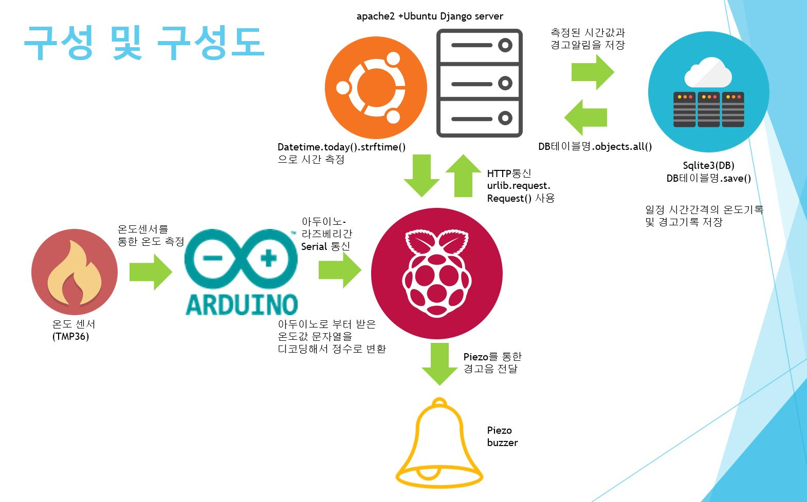

# 화재 경보 시스템

##  팀 소개
* 팀장: 전진우 팀원: 나윤호 김진우

## 목표

Raspberry Pi 와 Ubuntu machine을 서버로 이용한 network service를 창안하고 다음에 따라 구현한다.

* Raspberry Pi : server로 HTTP 프로토콜 PUT method로 얻은 data를 전달한다.

  > 참고: urllib.request.Request

* Server : Web application은 이를 받아 DB로 저장한다.

  Ubuntu에는 Apache Web server가 설치되고 django application으로 서비스를 제공한다. DB는 sqlite나 MYSQL을 사용한다.

* PC : 서비스 사용자들은 Web browser를 띄워 원하는 정보를 얻을 수 있어야 한다.

  > Git으로 source를 관리해야 하며, 완성되면 github repository의 URL을 제출한다. 발표할 PPT 파일도 이 repository에 저장해야 한다. (Markdown 언어로 작성해도 좋다.)

### 목적
* 온도센서를 이용해, 일정 온도 이상 올라갔을 시 피에조센서를 통하여 알람소리를 내어 사용자에게 위험을 알리며, 서버(db)에는 현재 온도 및 경고 기록을 저장한다. 

### 구성
#### Raspberry pi  

#### Apache Web server django application 

#### DB (sqlite) 

#### PC Web browser 

#### 시스템 구성도 

### Question and Answer